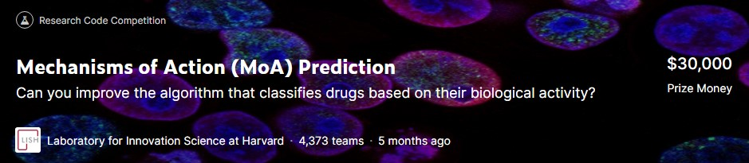
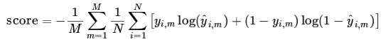
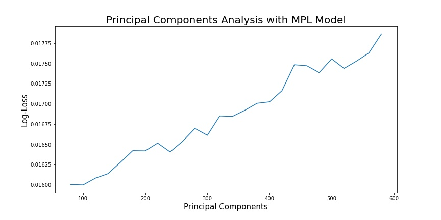
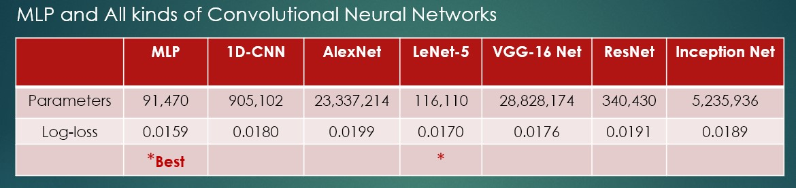
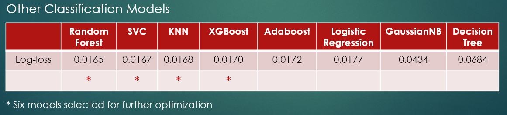
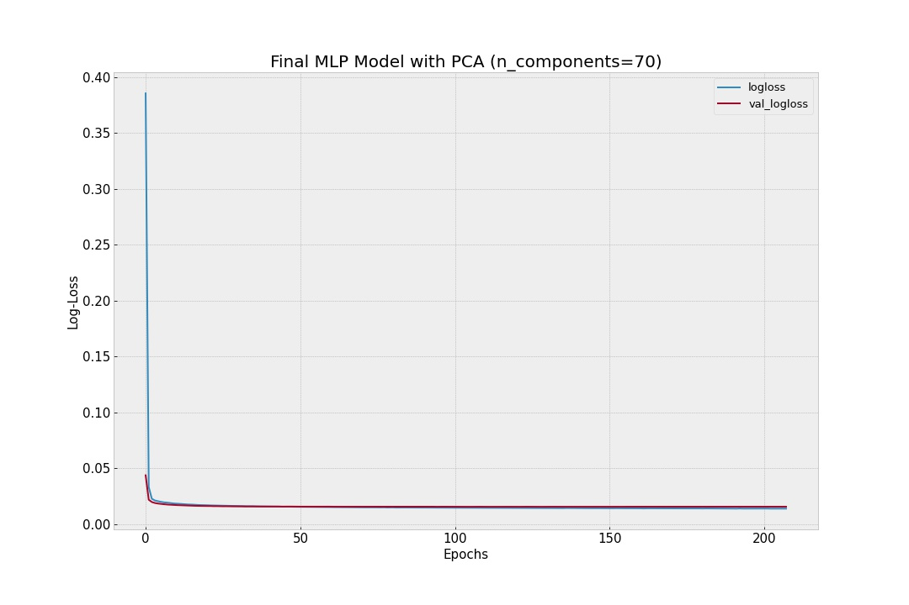

# **Galvanize-DSI-Capstone-Project-3**

## **Mechanisms of Action (MoA) Prediction**

This project is a Kaggle competition organized by MIT and Harvard. The goal is to advance drug development through MoA prediction.

MoA stands for the Mechanisms of Action of a drug. It classifies a drug’s type based on its underlying biological mechanism to treat a disease. 

The approach is to treat human cells with a drug and analyze the cellular responses, such as gene expression or cell viability patterns, then classify its MoA based on these measurements. It will in turn help scientists with the drug discovery process.

The task is to use the provided training dataset to develop a model that automatically labels any new drug as one or more MoA types. 

## **Data Source**

**[https://www.kaggle.com/c/lish-moa](https://www.kaggle.com/c/lish-moa)**

## **My Objective** 

Build all kinds of classification models and compare their performances.

## **The Challenges**

1. Since a drug can belong to a single, or multiple, or even several tens of MoA types, this project is a multi-label classification problem. There are as many as 206 labels in total. 
2. The competition required to use a custom metric to evaluate the accuracy of the model, namely the average value of the log loss function. The formula for calculating the log loss was provided.

3. Many of the features are highly correlated to each other.

## **EDA**

1. 17860 drug samples, 875 features including gene expression and cell viability patterns in response to drug treatment, 206 labels
2. 872 numerical features pre-normalized, following normal-like distributions
3. Correlation analysis showing that gene expression features are moderately correlated and cell viability features are highly correlated  

## **Data Wrangling**

1. No need to normalize data again
2. Data split into 60% train, 20% validation and 20% holdout

## **Baseline Models**

1. Multilayer Perceptron (MLP): 1 input, 1 hidden, 1 output layers, Log-loss 0.0183
2. 1-D Convolutional Neural Network (1D-CNN):  1 input, 2 hidden, 1 output layers, Log-loss 0.0194

## **Principal Component Analysis (PCA) and Dimensionality Reduction**

1. Component numbers scanned from 10 to 500 using baseline MLP model on AWS EC2 G4dn instance
2. 70 principal components chosen for dimensionality reduction

3. MLP model improved to a Log-loss of 0.0159

## **15 Classification Models**

  
## **Hyperparameter Tuning - Hyperopt**
 
1. All six model chosen optimized with Hyperopt which adopts Bayesian optimization algorithm
 
2. Best model MLP: 1 input, 2 hidden, 1 output layers, batch normalization, dropout, Log-loss 0.0156
 
## **Final Model on Dropout Data
 

 
Log-loss on dropout data: 0.0157
 
## **Conclusions**
 
1. The simple MLP neural network model worked best for my project
2. Principle Component Analysis (PCA) and Hyperopt were most helpful

## **Future Implementation** 

Ensembling different models for the prediction

**(Please see the PowerPoint slides and all the jupyter notebooks for codes and details)**

